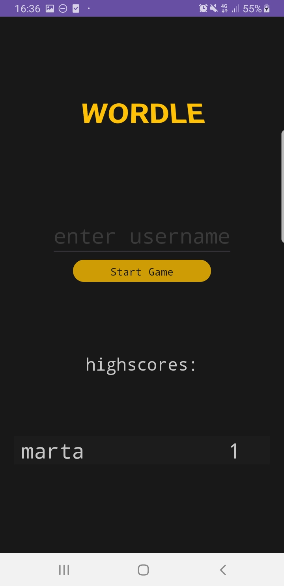
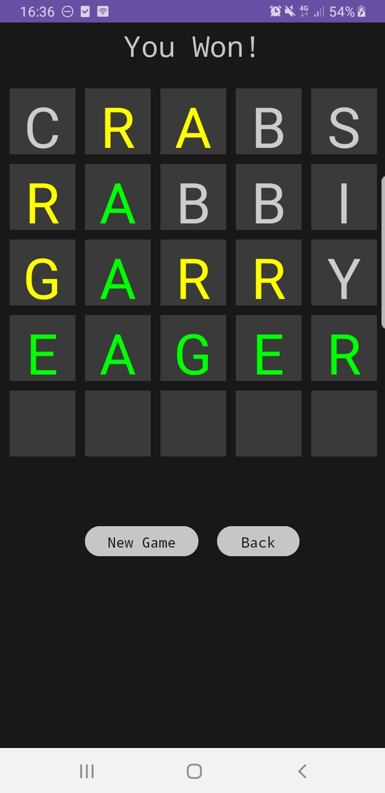

# WordleGame – Android App

This is a clone of NYT Wordle, implemented with Kotlin for Android

## Features

- Guess the 5-letter word in 6 tries
- Color-coded feedback after each guess
- Intuitive and responsive interface
- Built with Android Studio and Kotlin

### Installation

```bash
# Clone the repository
git clone https://github.com/martacepurite/WordleGame.git

# Open the project in Android Studio
# Build and run the app on your emulator or physical device
```
## Screenshots

### 🧩 Gameplay Screen


### 🏁 Start Screen with High Scores

